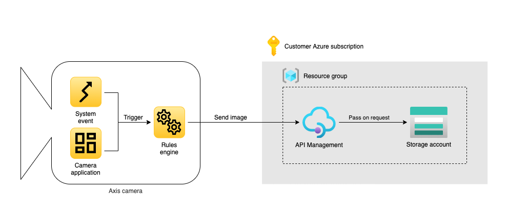

*Copyright (C) 2021, Axis Communications AB, Lund, Sweden. All Rights Reserved.*

<!-- omit in toc -->
# Images to Azure storage account

[](https://github.com/AxisCommunications/acap-integration-examples-azure/actions/workflows/images-to-azure-storage-account.yml)
[](https://github.com/AxisCommunications/acap-integration-examples-azure/actions/workflows/lint.yml)


<!-- omit in toc -->
## Table of contents

- [Overview](#overview)
- [Prerequisites](#prerequisites)
- [File structure](#file-structure)
- [Instructions](#instructions)
    - [Deploy Azure resources](#deploy-azure-resources)
    - [Configure the camera](#configure-the-camera)
- [Cleanup](#cleanup)
- [Troubleshooting](#troubleshooting)
    - [No images are sent to the Azure storage account](#no-images-are-sent-to-the-azure-storage-account)
- [License](#license)

## Overview

In this example we create an application that sends images from an Axis camera to an Azure storage account.



This application consists of the following Azure resources.

- An API Management instance
- A storage account with a blob container

The camera will send images to the blob container via an API Management endpoint. The API Management resource receives a POST request containing the image from the camera. This request is transformed to a PUT request as this is required by the Azure storage REST API. The API Management uses a system-assigned managed identity to authenticate to Azure storage. The API Management endpoint is secured by a subscription key which is provided to the camera.

## Prerequisites

- A network camera from Axis Communications (example has been verified to work on a camera with firmware version >=9.80.3.1)

No command-line terminal is needed to run this example even though command listings are present in the example. In some command listings, the commands are described as is, ready to be copied to your terminal and executed.

<!-- markdownlint-disable MD040 -->
```
this is a command
```

In other command listings, commands are preceded by a prompt symbol (`$`) when the output of the command also is of importance.

<!-- markdownlint-disable MD040 -->
```
$ this is a command
> This is output
```

Command listings where your input is required are marked using angle brackets (`<` and `>`).

```sh
some-command <your input>
```

For long commands, we use an escape character (`\`) to split a command over multiple lines.

On Linux and macOS, use your preferred shell and package manager. On Windows 10, you can [install the Windows Subsystem for Linux](https://docs.microsoft.com/windows/wsl/install) to get a Windows-integrated version of Ubuntu and Bash.

## File structure

<!-- markdownlint-disable MD040 -->
```
images-to-azure-storage-account
├── main.bicep    Azure Bicep template describing the Azure resources.
└── main.json     Azure Resource Manager (ARM) template describing the Azure resources.
```

## Instructions

The instructions are divided into two parts. The first part covers deploying the Azure resources and the second part covers configuring the camera.

### Deploy Azure resources

Let's deploy the Azure resources receiving the images sent from a camera. Navigate to the Azure Portal by right-clicking the button below and open the link in a new tab.

[](https://portal.azure.com/#create/Microsoft.Template/uri/https%3A%2F%2Fraw.githubusercontent.com%2FAxisCommunications%2Facap-integration-examples-azure%2Fmain%2Fimages-to-azure-storage-account%2Fmain.json)

The template, `main.bicep`, is written in [Bicep](https://docs.microsoft.com/en-us/azure/azure-resource-manager/bicep/), a language created by Microsoft to define infrastructure as code. It will require you to set the following custom parameters.

- **Publisher Email** - Email address that will receive all system notifications sent from the API-management resource.
- **Location** - The location to deploy all resources in. Default value tells Azure to deploy resources to the location of the resource group.

Once the deployment is complete, navigate to the *Outputs* tab and take note of the `endpoint` value. We will use this endpoint in the next chapter when we configure the camera.


### Configure the camera

Now that the resources in Azure are ready to accept images, let's continue with configuring the camera to send them.

Navigate to the camera using your preferred web browser. In the user interface of the camera, select *Settings* -> *System* -> *Events* -> *Device events*. In this user interface we'll do all configuration, but first let's get an overview of the available tabs.

- **Rules** - Here we'll create a rule that sends images to our Azure storage account
- **Schedules** - In this sample we'll use a schedule to define *when* a snapshot should be sent. If a schedule doesn't fit your specific use case, you can replace it with any event generated on the camera or even events generated by ACAPs installed on the camera.
- **Recipients** - Here we'll define *where* images are sent

Let's start with *Recipients*. Select the tab and create a new recipient with the following settings.

- **Name**: `Azure storage`
- **Type**: `HTTPS`
- **URL**: Specify the endpoint you obtained in the first part of this tutorial, for example: `https://image-upload-abcdefghijklm.azure-api.net?accessToken=abcdef1234567890abcdef1234567890`.

Click the *Save* button.

Now let's navigate to the *Schedules* tab. In this sample we'll use a schedule to define when a snapshot should be send. Create a new schedule with the following settings.

- **Type**: `Pulse`
- **Name**: `Every minute`
- **Repeat every**: `1 Minute`

Click the *Save* button.

Now let's navigate to the *Rules* tab. Here we'll finally create a rule that combines the recipient and the schedule into a rule. Create a new rule with the following settings.

- **Name**: `Images to Azure storage`
- **Condition**: `Pulse`
    - **Pulse**: `Every Minute`
- **Action**: `Send images through HTTPS`
    - **Recipient**: `Azure storage`
    - **Maximum images**: `1`

Click the *Save* button.

At this point the rule will become active and send a snapshot to Azure storage every minute. Navigate to your storage account in Azure Portal, select the container `images`, and within that container you will find the uploaded images.

## Cleanup

To delete the deployed Azure services, including all images in the storage account, either use the Azure Portal to delete the resource group, or run the following CLI command.

```sh
az group delete --name <resource group name>
```

The Azure API Management instance will be [soft-deleted](https://aka.ms/apimsoftdelete) and remain known to Azure for 48 hours. This will prevent you from redeploying the application to a resource group with the same name. Please select a new name for the resource group, wait 48 hours or [purge the instance using the Azure REST API](https://aka.ms/apimsoftdelete#purge-a-soft-deleted-instance).

## Troubleshooting

This section will highlight some of the common problems one might encounter when running this example application.

### No images are sent to the Azure storage account

If the camera is unable to successfully send images to the Azure storage account, please make sure that the following statements are true.

- **The camera is not behind a proxy**. This example does not support a network topology where requests needs to traverse a proxy to reach the internet.

## License

[Apache 2.0](./LICENSE)
