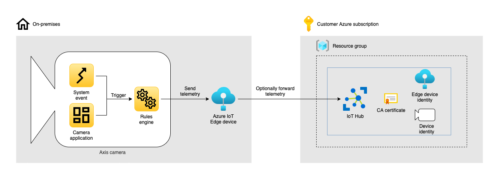

*Copyright (C) 2021, Axis Communications AB, Lund, Sweden. All Rights Reserved.*

# Telemetry to Azure IoT Edge <!-- omit in toc -->

[](https://github.com/AxisCommunications/acap-integration-examples-azure/actions/workflows/telemetry-to-azure-iot-edge.yml)


> Please note that this example is intended for proof-of-concepts and not for production. Efforts into making it production ready are under way, please stay tuned for updates.

## Table of contents <!-- omit in toc -->

- [Overview](#overview)
- [Prerequisites](#prerequisites)
- [File structure](#file-structure)
- [Instructions](#instructions)
- [Go to production](#go-to-production)
- [Cleanup](#cleanup)
- [Troubleshooting](#troubleshooting)
- [License](#license)

## Overview

This example builds upon the example [Telemetry to Azure IoT Hub](../telemetry-to-azure-iot-hub), but instead of sending telemetry to an IoT Hub in Azure we send it to [Azure IoT Edge](https://azure.microsoft.com/services/iot-edge) on-premises.



The application consists of the following on-premises resources.

- A network camera from Axis Communications
- A computer running any of the [operating systems supported by Azure IoT Edge](https://docs.microsoft.com/azure/iot-edge/support#operating-systems)

The application also consists of the following Azure resources.

- A resource group
- An IoT Hub

Having a downstream device, i.e. the Axis camera, connect to an Azure IoT Edge gateway enables us to support the following scenarios.

- The edge gateway can act as a local consolidated endpoint in networks where the camera is unable to directly connect to internet. In this scenario the Azure IoT Edge device is called [a transparent gateway](https://docs.microsoft.com/azure/iot-edge/how-to-create-transparent-gateway).
- The edge gateway can shield downstream devices from exposure to the internet (e.g., for security or compliance reasons).
- In the event of an internet outage, [IoT Edge modules](https://docs.microsoft.com/azure/iot-edge/module-development) can enable an application to remain operational by sending telemetry or video through the local network.
- The edge gateway can facilitate the transfer of telemetry to the IoT Hub for cameras that do not have the functionality to connect to IoT Hub independently.
- When power, space, or other considerations are critical factors for the choice of hardware, a lightweight edge device can be deployed on-premises as a transparent edge gateway, instead of a larger, more powerful machine.
- Telemetry can be processed on IoT Edge before being sent to the IoT Hub, filtering out unwanted messages.
- With horizontal compute, spreading AI processing between Axis cameras and the edge gateway creates flexible and cost competitive solutions. The cameras can run the initial processing (e.g., vehicle or motion detection) and, from those inferences, decide which frames to further post-process. Dedicated models can then be run on the edge gateway, providing added flexibility and value-producing insights.

If you are unable to acquire a computer on-premises, you can always provision a [virtual machine on Azure](https://azure.microsoft.com/services/virtual-machines).

## Prerequisites

> This example does currently not work on macOS with Azure CLI v2.30.0. Please downgrade to v2.29.0 or stay tuned for updates regarding the issue.

- A network camera from Axis Communications (example has been verified to work on a camera with firmware >=10.4)
- Azure CLI v2.29.0 or above ([install](https://docs.microsoft.com/cli/azure/install-azure-cli))
- Azure CLI IoT extension (add with `az extension add --name azure-iot`)
- OpenSSL ([install](https://www.openssl.org/))
- ssh (Secure Shell)
- scp (Secure Copy Protocol)

## File structure

```
telemetry-to-azure-iot-edge
├── create-certificates.sh         Bash script that creates X.509 certificates for secure
|                                  authentication and communication between camera, Azure IoT Edge
|                                  and Azure IoT Hub.
├── create-cloud-resources.sh      Bash script that creates Azure resources.
├── edge-gateway.deployment.json   Azure IoT Edge gateway deployment manifest that will deploy the
|                                  IoT Edge agent module and the IoT Edge hub module.
└── openssl.cnf                    Configuration file for OpenSSL.
```

## Instructions

The instructions are divided into three parts. The first part covers generating certificates, the second part covers deploying the Azure resources and the third part covers configuring the camera.

To start off, make sure to clone the repository and navigate into the example directory.

```bash
git clone https://github.com/AxisCommunications/acap-integration-examples-azure.git
cd acap-integration-examples-azure/telemetry-to-azure-iot-edge
```

### Create X.509 certificates

We start off with creating the required [X.509 certificates](https://docs.microsoft.com/azure/iot-hub/tutorial-x509-introduction). Certificates are used for authentication when the Axis camera connects to Azure IoT Edge, and when Azure IoT Edge connects to the Azure IoT Hub.

> Disclaimer: The generated X.509 certificates are valid for 365 days, which means that a solution deployed with these certificates will be operational for about a year. To remain operational longer that that, update the script to generate certificates with a longer validity, or re-provision the solution after expiration.

> Disclaimer: The generated X.509 certificates are self-signed. To root the certificates in a trusted root Certificate Authority (CA), please contact a trusted commercial certificate authority like Baltimore, Verisign, or DigiCert.

Create the certificates by running the bash script `create-certificates.sh` with the following positional arguments.

1. `organization name` - The name of your organization
2. `edge gateway hostname` - The hostname of the Azure IoT Edge gateway, i.e. a name on the network that resolves into a IPv4 address that points to the computer where we will install Azure IoT Edge, e.g. `azureiotedgedevice`
3. `device identity` - The device identity of the camera in Azure IoT Hub, e.g. `device01`

The following output indicate that all certificates have been created successfully (for brevity, output from OpenSSL commands are not shown).

```
$ ./create-certificates.sh "My organization" azureiotedgedevice device01
> Checking local directory for root CA certificate...
> Root CA certificate does not exist in local directory, creating it...
> Checking local directory for edge gateway certificate...
> Edge gateway certificate does not exist in local directory, creating it...
> Checking local directory for edge gateway CA certificate...
> Azure edge gateway CA certificate does not exist in local directory, creating it...
> Checking local directory for device certificate...
> Device certificate does not exist in local directory, creating it...
>
> Done!
>
> The following certificates have been created.
>
> Root Certificate Authority (CA) certificate
> --------------------------------------------------------------------------
> All other certificates we generate are rooted in this certificate, and
> later on in the example we will upload this certificate to the Azure IoT
> Hub and to the Azure IoT Edge gateway.
>
> Files:
>     ./cert/ca.pem
>     ./cert/ca.key
>
>
> Edge gateway certificate
> --------------------------------------------------------------------------
> The device certificate used when Azure IoT Edge connects to, and
> authenticates with, the Azure IoT Hub. This certificate will be installed
> on the Azure IoT Edge gateway.
>
> Files:
>     ./cert/azureiotedgedevice.pem
>     ./cert/azureiotedgedevice.key
>
>
> Azure IoT Edge intermediate Certificate Authority (CA) certificate
> --------------------------------------------------------------------------
> The intermediate CA certificate used when Azure IoT Edge accepts
> connections from downstream devices, i.e. the Axis camera. This
> certificate will be installed on the Azure IoT Edge gateway.
>
> Files:
>     ./cert/azureiotedgedevice_ca.pem
>     ./cert/azureiotedgedevice_ca.key
>
>
> Azure IoT device certificate
> --------------------------------------------------------------------------
> The device certificate used when the Axis camera connects to, and
> authenticates with, Azure IoT Edge. This certificate will be installed on
> the Axis camera.
>
> Files:
>     ./cert/device01.pem
>     ./cert/device01.key
```

### Deploy Azure resources

With the certificates created we are ready to deploy the required Azure resources. But before we do, let's verify the currently selected Azure subscription.

```bash
az account show --query name --output tsv
```

To change into a new subscription, please run the following command.

```bash
az account set --subscription <name or id of subscription>
```

With the correct subscription selected, call the bash script `create-cloud-resources.sh` with the following positional arguments.

1. `resource group name` - The name of a new or existing resource group in Azure, e.g. `MyResourceGroup`
2. `location` - The name of the Azure location where the resources should be created, e.g. `eastus` for East US
3. `iot hub name` - The name of the IoT Hub resource, e.g. `my-iot-hub`
4. `edge gateway hostname` - The hostname of the Azure IoT Edge gateway, i.e. a name on the network that resolves into a IPv4 address that points to the computer where we will install Azure IoT Edge, e.g. `azureiotedgedevice`. This hostname will also be used as the identity of the Azure IoT Edge device in Azure IoT Hub.
5. `device identity` - The identity of the device in Azure IoT Hub, e.g. `device01`

The following output indicate that all resources have been created successfully.

```
$ ./create-cloud-resources.sh MyResourceGroup eastus my-iot-hub azureiotedgedevice device01
> Creating resource group 'MyResourceGroup' in 'eastus' if it does not exist...
> Checking if IoT Hub 'my-iot-hub' in resource group 'MyResourceGroup' exists...
> IoT Hub does not exist, creating it...
> Checking if root CA certificate is uploaded to IoT Hub...
> IoT Hub root CA certificate does not exist, uploading local root CA certificate...
> Checking if device identity exists in IoT Hub...
> Device identity 'device01' does not exist in IoT Hub, creating it...
> Checking if IoT Edge device identity exists in IoT Hub...
> IoT Edge device identity 'azureiotedgedevice' does not exist in IoT Hub, creating it...
> Setting default modules on IoT Edge device...
>
> Done!
>
> The following settings will be used when configuring the camera.
>
> MQTT Client Configuration
> Host:       azureiotedgedevice
> Username:   azureiotedgedevice/device01/?api-version=2018-06-30
> Client id:  device01
>
> MQTT Event Configuration
> Custom condition prefix:  devices/device01/messages/events/
```

At this point we've got the required resources deployed in Azure, and are ready to install Azure IoT Edge on the IoT Edge gateway.

### Install Azure IoT Edge

IoT Edge will be installed on a computer, also known as the gateway, on-premises. Azure IoT Edge is a software we install on any of its [supported operating systems](https://docs.microsoft.com/azure/iot-edge/support#operating-systems), but before we do we should copy the generated certificates to the gateway. The reason for copying the certificates prior to installing Azure IoT Edge is that the install instructions will refer to these certificates, and at that point it's important that you understand the difference between them, and their usage. These are the certificates we will copy to the gateway.

- `cert/ca.pem` - The public key of the root Certificate Authority (CA) certificate
- `cert/<edge gateway hostname>.pem` / `cert/<edge gateway hostname>.key` - The public and private key of the certificate used when Azure IoT Edge connects to, and authenticates with, the Azure IoT Hub
- `cert/<edge gateway hostname>_ca.pem` / `cert/<edge gateway hostname>_ca.key` - The public and private key of the intermediate Certificate Authority (CA) certificate used when Azure IoT Edge accepts connections from downstream devices, i.e. the Axis camera

With the hostname specified when creating the certificates, and with a valid username on the Azure IoT Edge gateway, run the following commands to copy the certificates.

```bash
edge_device_hostname=<edge gateway hostname>
username=<username>
scp -p cert/ca.pem \
   cert/$edge_device_hostname.pem \
   cert/$edge_device_hostname.key \
   cert/${edge_device_hostname}_ca.pem \
   cert/${edge_device_hostname}_ca.key \
   $username@$edge_device_hostname:/home/$username
```

As an example, given that the hostname is `azureiotedgedevice` and the username is `pi`, the commands would look like this.

```bash
edge_device_hostname=azureiotedgedevice
username=pi
scp -p cert/ca.pem \
   cert/$edge_device_hostname.pem \
   cert/$edge_device_hostname.key \
   cert/${edge_device_hostname}_ca.pem \
   cert/${edge_device_hostname}_ca.key \
   $username@$edge_device_hostname:/home/$username
```

With the certificates successfully uploaded, please proceed with connecting to the Azure IoT Edge gateway using ssh and [install Azure IoT Edge](https://docs.microsoft.com/azure/iot-edge/how-to-provision-single-device-linux-x509#install-iot-edge). If you encounter any issues, please make sure to read through the [Troubleshooting](#troubleshooting) section.

After a successful installation the configuration file `/etc/aziot/config.toml` will look like this, given that your Azure IoT Hub hostname is `example.azure-devices.net`, your IoT Edge gateway hostname is `azureiotedgedevice`, and the computer username is `pi`.

```
# ==============================================================================
# Hostname
# ==============================================================================
#
# Uncomment the next line to override the default hostname of this device.
hostname = "azureiotedgedevice"

# Manual provisioning with X.509 certificate
[provisioning]
source = "manual"
iothub_hostname = "example.azure-devices.net"
device_id = "azureiotedgedevice"

[provisioning.authentication]
method = "x509"
identity_pk = "file:///home/pi/azureiotedgedevice.key"
identity_cert = "file:///home/pi/azureiotedgedevice.pem"
```

With Azure IoT Edge installed and successfully connected to the Azure IoT Hub we've come a long way. The final step is configuring Azure IoT Edge to accept connections from downstream devices, i.e. becoming a [transparent gateway](https://docs.microsoft.com/azure/iot-edge/how-to-create-transparent-gateway).

In `/etc/aziot/config.toml`, please update the `trust_bundle_cert` parameter to reference the root Certificate Authority (CA) certificate, and the `[edge_ca]` section to reference the intermediate Certificate Authority (CA) certificate. Given that your IoT Edge gateway hostname is `azureiotedgedevice` and the computer username is `pi`, the relevant parts of the configuration file would look like this.

```
# ==============================================================================
# Trust bundle cert
# ==============================================================================
#
# If you have any trusted CA certificates required for Edge module communication,
# uncomment the next line and set the value to a file URI for
# the path of the file.

trust_bundle_cert = "file:///home/pi/ca.pem"

# ==============================================================================
# Edge CA certificate
# ==============================================================================
#
# If you have your own Edge CA certificate that you want all module certificates
# to be issued by, uncomment this section and replace the values with your own.

[edge_ca]
cert = "file:///home/pi/azureiotedgedevice_ca.pem"
pk = "file:///home/pi/azureiotedgedevice_ca.key"
```

Apply the new configuration and verify the status of Azure IoT Edge by running the following commands.

```bash
sudo iotedge config apply
sudo iotedge check
```

At this point the IoT Edge runtime is configured to accept MQTT connections from a camera.

### Configuring the camera

Now that the resources in Azure are ready to accept telemetry, let's continue with configuring the camera to send events.

We will begin by uploading our device certificate and the root CA certificate to the camera. Start by navigating to the camera using your preferred web browser. To add a device certificate, follow the steps below.

1. In the user interface of the camera, select *Settings* -> *System* -> *Security*
1. Under the list of *Client certificates*, click on "*+*" to add a new certificate
1. Select *Upload certificate* and click on *OK*
1. Select *Separate private key*
1. For the certificate, click on *Select file* and browse to `cert/` and select `<device identity>.pem`, e.g. `device01.pem`
1. For the private key, click on *Select file* and browse to `cert/` and select `<device identity>.key`, e.g. `device01.key`
1. Click on *Install*

While still in *Security*, let's continue to upload the root CA certificate.

1. Under the list of *CA certificates*, click on "*+*" to add a new CA certificate
1. For the CA certificate, click on *Select file* and browse to `cert/` and select `ca.pem`
1. Click on *Install*

The next step is to configure the MQTT client on the camera.

1. In the user interface of the camera, select *Settings* -> *System* -> *MQTT*
1. In the *Server* section use the following settings
   - Protocol: `MQTT over WebSocket Secure`
   - Host: `<edge gateway hostname>`, e.g. `azureiotedgedevice`
   - Port: `443`
   - Basepath: `$iothub/websocket`
   - Username `<edge gateway hostname>/<device identity>/?api-version=2018-06-30`, e.g. `azureiotedgedevice/device01/?api-version=2018-06-30`
1. Under the *Certificate* section use the following settings
   - Client certificate: `<device identity>`, e.g. `device01`
   - CA certificate: `ca`
   - Validate server certificate: `checked`
1. Under the *Policies* section use the following sections
   - Client id: `<device identity>`, e.g. `device01`
1. Click *Save*

Once the settings are saved, click on *Connect* on the top of the MQTT settings page.

Let's continue with configuring the event type we wish to send to the Azure IoT Hub. For the sake of simplicity we create a new schedule that triggers an event every 5 seconds, because the event is predictable and doesn't require any physical access to the camera. You can change this event to any type sent by the camera or an installed ACAP application.

1. In the user interface of the camera, select *Settings* -> *System* -> *Events* -> *Device events* -> *Schedules*
1. Create a new schedule with the following settings
   - **Type**: `Pulse`
   - **Name**: `Every 5 seconds`
   - **Repeat every**: `5 Seconds`
1. Click *Save*

Finally select pulses to be the event type the camera sends to the Azure IoT Hub.

1. While still in *Events*, select *MQTT events*
1. In the *Publish* section use the following settings
   - **Use default condition prefix**: `Off`
   - **Custom condition prefix**: `devices/<device identity>/messages/events/`, e.g. `devices/device01/messages/events/`
   - **Include condition name**: `unchecked`
   - **Include condition namespaces**: `unchecked`
   - **Include serial number in payload**: `checked`
1. In the *Event filter list* section use the following settings
   - **Condition**: `Pulse`
1. Click on *Save*

At this point the camera is sending a new event every 5 seconds to the Azure IoT Hub. You can monitor events by using the Azure CLI.

```bash
az iot hub monitor-events --hub-name <iot hub name>
```

## Go to production

This example is intended for proof-of-concepts. The following chapters will highlight some of the issues you must solve before going to production.

### Securely store certificates on the gateway

The keys for the certificates on the gateway are not securely stored. Their file permissions allow any user on the computer to access them. This is not acceptable in production.

A secure solution would be to store the certificates using a [hardware security module (HSM)](https://en.wikipedia.org/wiki/Hardware_security_module), like a [Trusted Platform Module (TPM)](https://en.wikipedia.org/wiki/Trusted_Platform_Module). We're currently looking into enhancing this example with instructions on how to store certificates on hardware security modules. Please stay tuned for updates.

### Create private certificate keys on the devices

Private keys for certificates should never leave the device on which they are being used operationally. This means that keys should be created on the gateway and on the camera. From these keys new [certificate signing requests (CSR)](https://en.wikipedia.org/wiki/Certificate_signing_request) can to be created, and then signed using the root, or an intermediate, Certificate Authority (CA).

### Zero-touch provisioning

Depending on the number of gateways and Axis cameras, scale might be an issue. Manually configuring one gateway and one camera is feasible. Manually configuring thousands isn't. To that end, Microsoft has released [Secure IoT begins with Zero-Touch Provisioning at scale](https://aka.ms/igem_whitepaper) and [The blueprint to securely solve the elusive zero-touch provisioning of IoT devices at scale](https://aka.ms/igem_msft_blog), alleviating the effort of provisioning devices at scale.

## Cleanup

To delete all deployed resources in Azure, run the following CLI command

```bash
az group delete --name <resource group name>
```

## Troubleshooting

This section will highlight some of the common problems one might encounter when running this example application.

### Azure IoT Edge cannot read X.509 certificates

If you find that the command `sudo iotedge system status` is indicating that service `aziot-identityd` has status `Down - activating`, in combination with command `sudo iotedge system logs` indicating `Permission denied (os error 13)`, then the issue might relate to the permissions on the uploaded X.509 certificate files.

Navigate to the directory where the X.509 certificate files are stored. Let's assume that the certificates are stored in the user's home directory, e.g. `/home/pi`. In that directory, issue the following command.

```
$ ls -la
> -rw-r-----  1 pi   pi   3243 Oct 10 01:00 azureiotedgedevice_ca.key
> -rw-r-----  1 pi   pi   3969 Oct 10 01:00 azureiotedgedevice_ca.pem
> -rw-r-----  1 pi   pi   1679 Oct 10 01:00 azureiotedgedevice.key
> -rw-r-----  1 pi   pi   1765 Oct 10 01:00 azureiotedgedevice.pem
> -rw-r-----  1 pi   pi   2013 Oct 10 01:00 ca.pem
```

The output above is an indication of the problem. The file permissions only allow the currently logged in user, and its group, to read the files. But as it turns out, Azure IoT Edge needs to be able to read them as well.

In the same terminal, issue the following commands to allow all users on the computer to read the certificates.

```bash
chmod o+r *.pem
chmod o+r *.key
sudo iotedge system restart
```

For a detailed explanation regarding file permissions configuration in Linux, please see [Chmod Calculator](https://chmodcommand.com/).

### MQTT client cannot connect to the Azure IoT Hub

If the MQTT client is unable to successfully connect to the Azure IoT Edge gateway, please make sure that the following statements are true.

- **The camera date and time is correctly configured**. The date and time of the camera needs to be correctly configured.

## License

[Apache 2.0](./LICENSE)
