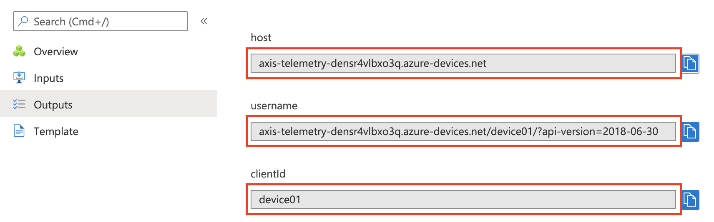

*Copyright (C) 2021, Axis Communications AB, Lund, Sweden. All Rights Reserved.*

# Telemetry to Azure IoT Hub <!-- omit in toc -->

[](https://github.com/AxisCommunications/acap-integration-examples-azure/actions/workflows/telemetry-to-azure-iot-hub.yml)


## Table of contents <!-- omit in toc -->

- [Overview](#overview)
- [Prerequisites](#prerequisites)
- [File structure](#file-structure)
- [Instructions](#instructions)
- [Cleanup](#cleanup)
- [Troubleshooting](#troubleshooting)
- [License](#license)

## Overview

In this example we create an application where we send telemetry data from our camera up to an IoT Hub in Azure. Telemetry data from the camera could be motion detection events or custom events from ACAP applications installed on the camera.


The application consists of the following Azure resources.

- A resource group
- An IoT Hub
- A Key Vault

An Axis camera has an internal MQTT client that will connect to the IoT Hub in Azure. The camera authenticates to the IoT Hub using a X.509 certificate.

## Prerequisites

- A network camera from Axis Communications (example has been verified to work on a camera with firmware >=10.4)

## File structure

```
telemetry-to-azure-iot-hub
├── main.bicep    Azure Bicep template describing the Azure resources.
└── main.json     Azure Resource Manager (ARM) template describing the Azure resources.
```

## Instructions

The instructions are divided into two parts. The first part covers deploying the Azure resources and the second part covers configuring the camera.

### Deploy Azure resources

> Disclaimer: The generated X.509 certificates are valid for 365 days, which means that a solution deployed with these certificates will be operational for about a year. To remain operational longer that that, update the script to generate certificates with a longer validity, or re-provision the solution after a year when the certificates have expired.

> Disclaimer: The generated X.509 certificates are self-signed. To root the certificates in a trusted root Certificate Authority (CA), please contact a trusted commercial certificate authority like Baltimore, Verisign, or DigiCert.

Let's deploy the Azure resources required to receive telemetry from a camera. Navigate to the Azure Portal by right-clicking the button below and open the link in a new tab.

[](https://portal.azure.com/#create/Microsoft.Template/uri/https%3A%2F%2Fraw.githubusercontent.com%2FAxisCommunications%2Facap-integration-examples-azure%2Fmain%2Ftelemetry-to-azure-iot-hub%2Fmain.json)

The template will require the following custom parameters.

- **Object ID** - The object ID of your Azure Active Directory user. The object ID can be found either by navigating to your user in Azure Active Directory, or by running the following command in the [Azure Cloud Shell](https://azure.microsoft.com/features/cloud-shell/): `az ad signed-in-user show --query objectId --output tsv`.
- **Organization name** - The name of your organization, used when generating the X.509 certificates
- **IoT Hub name** - The name of the IoT Hub. Please note that the name must be unique, i.e. two IoT Hubs in Azure cannot share the same name.
- **Device identity** - The name of the IoT device, used for authentication and access control

Once the deployment is complete, navigate to the *Outputs* tab and take note of the values with name `host`, `username` and `clientId`. We will use these values in the next chapter when we configure the camera.



### Configure the camera

Now that the resources in Azure are ready to accept telemetry, let's continue with configuring the camera to send events.

We will begin by downloading the device certificate from Azure Key Vault.

1. In Azure Portal, navigate to your newly created resource group
1. Select your Key Vault instance
1. Select *Certificates* under *Settings* in the left pane of your Key Vault instance
1. Click the `device` certificate
1. Click on the current version of the certificate
1. Download the certificate by clicking the *Download in PFX/PEM format* toolbar button

With the device certificate downloaded to your computer, we're ready to configure the Axis camera. Start by navigating to the camera using your preferred web browser. To add a device certificate, follow the steps below.

1. In the user interface of the camera, select *Settings* -> *System* -> *Security*
1. Under the list of *Client certificates*, click on "*+*" to add a new certificate
1. Select *Upload certificate* and click on *OK*
1. Select *Private key (PKCS#12)*
1. Click on *Select file* and browse to your downloaded device certificate
1. Click on *Install*

The next step is to configure the MQTT client on the camera.

1. In the user interface of the camera, select *Settings* -> *System* -> *MQTT*
1. In the *Server* section use the following settings
   - Protocol: `MQTT over WebSocket Secure`
   - Host: `<iot hub name>.azure-devices.net`, i.e. the `host` output value from the Azure deployment
   - Port: `443`
   - Basepath: `$iothub/websocket`
   - Username `<iot hub name>.azure-devices.net/<device identity>/?api-version=2018-06-30`, i.e. the `username` output value from the Azure deployment
1. Under the *Certificate* section use the following settings
   - Client certificate: `<device certificate>`, i.e. the device certificate we just uploaded to the camera
   - CA certificate: `Baltimore CyberTrust Root`
   - Validate server certificate: `checked`
1. Under the *Policies* section use the following sections
   - Client id: `<device identity>`, i.e. the `clientId` output value from the Azure deployment
1. Click *Save*

Once the settings are saved, click on *Connect* on the top of the MQTT settings page.

Let's continue with configuring the event type we wish to send to the Azure IoT Hub. For the sake of simplicity we create a new schedule that triggers an event every 5 seconds, because the event is predictable and doesn't require any physical access to the camera. You can change this event to any type sent by the camera or an installed ACAP application.

1. In the user interface of the camera, select *Settings* -> *System* -> *Events* -> *Device events* -> *Schedules*
1. Create a new schedule with the following settings
   - **Type**: `Pulse`
   - **Name**: `Every 5 seconds`
   - **Repeat every**: `5 Seconds`
1. Click *Save*

Finally select pulses to be the event type the camera sends to the Azure IoT Hub.

1. While still in *Events*, select *MQTT events*
1. In the *Publish* section use the following settings
   - **Use default condition prefix**: `Off`
   - **Custom condition prefix**: `devices/<device identity>/messages/events/`, e.g. `devices/device01/messages/events/`
   - **Include condition name**: `unchecked`
   - **Include condition namespaces**: `unchecked`
   - **Include serial number in payload**: `checked`
1. In the *Event filter list* section use the following settings
   - **Condition**: `Pulse`
1. Click on *Save*

At this point the camera is sending a new event every 5 seconds to the Azure IoT Hub. You can monitor events by using the Azure CLI.

```bash
az iot hub monitor-events --hub-name <iot hub name>
```

### Add additional IoT devices

To add additional IoT devices to your deployed application, please open [Azure Portal](https://portal.azure.com) in a web browser and navigate to the deployed IoT Hub. In the IoT Hub, select *Devices* under *Device management* in the left pane, and then click the *Add Device* toolbar button.

Assuming that the new device will be named `device02`, enter the following information and then click the *Save* button.

- **Device ID**: `device02`
- **Authentication type**: `X.509 CA Signed`

With the new device created, navigate to your Key Vault instance and select *Certificates* under *Settings* in the left pane. Click the `ca` certificate and download it in the same way as you previously downloaded the `device` certificate.

With the CA certificate downloaded, and assumed to have the name `keyvault.pfx`, please open a terminal and run the following commands to create a new device certificate. At this point you will need to have [OpenSSL](https://www.openssl.org/) installed on your computer.

```
# Define a variable with the name of the new device
device_identity=device02

# Define a variable pointing at the downloaded CA certificate
ca_path=keyvault.pfx

# Generate a new private key
openssl genrsa -out "$device_identity.key" 2048

# Generate a new certificate signing request (CSR)
openssl req -new -key "$device_identity.key" -subj "/CN=$device_identity" \
   -out "$device_identity.csr"

# Convert the CA certificate from PFX format to PEM format (press enter when
# asked for password)
openssl pkcs12 -in "$ca_path" -nodes -out ca.pem

# Create the new device certificate
openssl x509 -req -in "$device_identity.csr" -CA ca.pem -CAcreateserial \
   -days 365 -sha256 -out "$device_identity.pem"

# Convert the device certificate from PEM format to PFX format
openssl pkcs12 -inkey "$device_identity.key" -in "$device_identity.pem" -export \
   -passout pass: -out "$device_identity.pfx"
```

With the new device certificate `device02.pfx` created, please proceed to upload the certificate to the camera, and then configure the camera using the same steps as the first camera in the application.


## Cleanup

To delete all deployed resources in Azure, run the following CLI command

```bash
az group delete --name <resource group name>
```

## Troubleshooting

This section will highlight some of the common problems one might encounter when running this example application.

### MQTT client cannot connect to the Azure IoT Hub

If the MQTT client is unable to successfully connect to the Azure IoT Hub, please make sure that the following statements are true.

- **The camera is not behind a proxy**. This example does not support a network topology where requests needs to traverse a proxy to reach the internet.
- **The camera date and time is correctly configured**. The date and time of the camera needs to be correctly configured.

## License

[Apache 2.0](./LICENSE)
