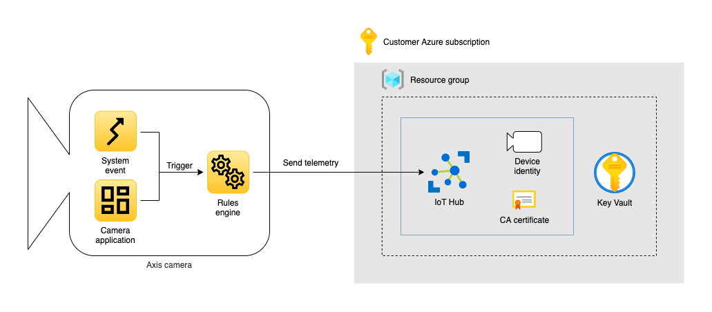

_Copyright (C) 2021, Axis Communications AB, Lund, Sweden. All Rights Reserved._

# Telemetry to Azure IoT Hub

[](https://github.com/AxisCommunications/acap-integration-examples-azure/actions/workflows/telemetry-to-azure-iot-hub.yml)

## Table of contents

- [Overview](#overview)
- [Prerequisites](#prerequisites)
- [File structure](#file-structure)
- [Instructions](#instructions)
- [Cleanup](#cleanup)
- [License](#license)

## Overview

In this example we create an application where we send telemetry data from our camera up to an IoT Hub in Azure. Telemetry data from the camera could be motion detection events or custom events from ACAP applications installed on the camera.



The application consists of the following Azure resources.

- A resource group
- An IoT Hub

An Axis camera has an internal MQTT client that will connect to the IoT Hub in Azure. The camera authenticates to the IoT Hub using an X.509 certificate.

## Prerequisites

- A network camera from Axis Communications (example has been verified to work on a camera with firmware >=10.4)
- Azure CLI (v2.3.1 or above) ([install](https://docs.microsoft.com/en-us/cli/azure/install-azure-cli))
- Azure CLI IoT extension (add with `az extension add --name azure-iot`)
- OpenSSL ([install](https://www.openssl.org/))

## File structure

```
telemetry-to-azure-iot-hub
└── create-cloud-resources.sh - Bash script that creates Azure resources and certificates for secure communication between camera and cloud
```

## Instructions

The instructions are divided into two parts. The first part covers deploying the Azure resources and the second part covers configuring the camera.

To start off, make sure to clone the repository and navigate into the example directory.

```bash
git clone https://github.com/AxisCommunications/acap-integration-examples-azure.git
cd acap-integration-examples-azure/telemetry-to-azure-iot-hub
```

### Deploy Azure resources

Let's deploy the Azure resources required to receive telemetry from a camera. We have two alternatives when it comes to deploying the Azure resources. The first alternative is to run a bash script that performs all the necessary commands. The second alternative is to run all the commands manually.

#### Deploy Azure resources using a bash script

The bash script `create-cloud-resources.sh` should be called with the following positional arguments.

1. `resource group name` - The name of a new or existing resource group in Azure
1. `location` - The name of the Azure location where the resources should be created, e.g. `eastus` for East US
1. `iot hub name` - The name of the IoT Hub resource
1. `device identity name` - The identity of the device in IoT Hub

The following output indicate that all resources have been created successfully (for brevity, output from OpenSSL commands are not shown).

```
$ ./create-cloud-resources.sh MyResourceGroup eastus my-iot-hub device01
> Creating resource group 'MyResourceGroup' in 'eastus' if it does not exist...
> Checking if IoT Hub 'my-iot-hub' in resource group 'MyResourceGroup' exists...
> IoT Hub does not exist, creating it...
> Checking local directory for CA certificate...
> CA certificate does not exist in local directory, creating it...
> Checking if CA certificate is uploaded to IoT Hub...
> IoT Hub CA certificate does not exist, uploading local CA certificate...
> Checking if IoT Hub CA certificate is verified...
> Proving possession of CA certificate private key to IoT Hub...
> Checking local directory for device certificate...
> Device certificate does not exist in local directory, creating it...
> Checking if device identity exists in IoT Hub...
> Device identity 'device01' does not exist in IoT Hub, creating it...
>
> Done!
>
> The following settings will be used when configuring the camera
>
> MQTT Client Configuration
> Host:      my-iot-hub.azure-devices.net
> Username:  my-iot-hub.azure-devices.net/device01/?api-version=2018-06-30
> ClientID:  device01
>
> MQTT Event Configuration
> Custom condition prefix:  devices/device01/messages/events/
```

You can rerun the script with different device identity names in order to add additional cameras.

#### Deploy Azure resources manually

To keep all resources in Azure grouped together we want to create a new resource group. To create a new resource group named `MyResourceGroup` in the `eastus` Azure location run the following commands in your shell.

```bash
resource_group_name=MyResourceGroup
location=eastus
az group create --name $resource_group_name --location $location
```

Next we create the IoT Hub named `my-iot-hub`. We select the S1 tier and a capacity of 1 unit, this is enough to test this application.

```bash
iot_hub_name=my-iot-hub
az iot hub create \
    --name $iot_hub_name \
    --resource-group $resource_group_name \
    --location $location \
    --sku S1 \
    --unit 1
```

We want to use X.509 certificates to authenticate our camera to the IoT Hub. We will create two certificates and place them in a new directory we call `cert`. The first certificate is the Certificate Authority (CA) certificate, which will be uploaded to the Azure IoT Hub.

```bash
mkdir -p cert
openssl genrsa -out ./cert/ca.key 2048
openssl req -x509 -new -nodes -key ./cert/ca.key -sha256 -days 3650 -subj "/O=example.com/CN=example.com" -out ./cert/ca.pem
```

The next certificate is a device certificate which is derived from the CA certificate, this certificate will be uploaded to the camera. Each device we connect to the IoT Hub requires a unique identity name. In this example we will give our device the identity `device01`.

```bash
device_identity_name=device01
openssl genrsa -out ./cert/$device_identity_name.key 2048
openssl req -new -key ./cert/$device_identity_name.key -subj "/CN=$device_identity_name" -out ./cert/$device_identity_name.csr
openssl x509 -req -in ./cert/$device_identity_name.csr -CA ./cert/ca.pem -CAkey ./cert/ca.key -CAcreateserial -out ./cert/$device_identity_name.crt -days 3650 -sha256
```

Now we have our certificates and we will upload them to where they need to go. First we upload the CA certificate with the name `ca` to the IoT Hub. We store the certificate ETag, which we will need in a later step.

```bash
ca_certificate_name=ca
cert_etag=$(az iot hub certificate create \
    --resource-group $resource_group_name \
    --hub-name $iot_hub_name \
    --name $ca_certificate_name \
    --path ./cert/ca.pem \
    --query etag \
    --output tsv)
```

The CA certificate is uploaded to the IoT Hub, but we need to prove ownership of the corresponding certificate private key. The first step in this procedure is to generate a verification code.

```bash
verification_code=$(az iot hub certificate generate-verification-code \
    --name $ca_certificate_name \
    --resource-group $resource_group_name \
    --hub-name $iot_hub_name \
    --etag $cert_etag \
    --query properties.verificationCode \
    --output tsv)
```

We can now create a new certificate and specify the verification code as the common-name and finally sign the certificate using the CA certificate private key.

```bash
openssl genrsa -out ./cert/proof.key 2048
openssl req -new -key ./cert/proof.key -subj "/CN=$verification_code" -out ./cert/proof.csr
openssl x509 -req -in ./cert/proof.csr -CA ./cert/ca.pem -CAkey ./cert/ca.key -sha256 -CAcreateserial -out ./cert/proof.pem
```

To complete the verification process we upload the `proof.pem` certificate to the IoT Hub.

```bash
cert_etag=$(az iot hub certificate show \
    --name $ca_certificate_name \
    --hub-name $iot_hub_name \
    --query etag \
    --output tsv)

az iot hub certificate verify \
    --resource-group $resource_group_name \
    --hub-name $iot_hub_name \
    --name $ca_certificate_name \
    --path ./cert/proof.pem \
    --etag $cert_etag
```

Our CA certificate is now verified and we can create our device identity in the IoT Hub.

```bash
az iot hub device-identity create \
    --resource-group $resource_group_name \
    --hub-name $iot_hub_name \
    --device-id $device_identity_name \
    --auth-method x509_ca
```

Now we have everything we need and we can view our MQTT host, username and client id with the following commands.

```bash
$ echo "Host: $iot_hub_name.azure-devices.net"
> Host: my-iot-hub.azure-devices.net
$ echo "Username: $iot_hub_name.azure-devices.net/$device_identity_name/?api-version=2018-06-30"
> Username: my-iot-hub.azure-devices.net/device01/?api-version=2018-06-30
$ echo "Client id: $device_identity_name"
> Client id: device01
```

We will use these parameters in the next chapter where we will configure the camera!

### Configuring the camera

Now that the resources in Azure are ready to accept telemetry, let's continue with configuring the camera to send events.

We will begin by uploading our device certificate to the camera. Start by navigating to the camera using your preferred web browser. To add a device certificate, follow the steps below.

1. In the user interface of the camera, select _Settings_ -> _System_ -> _Security_
1. Under the list of _Client certificates_, click on "_+_" to add a new certificate
1. Select _Upload certificate_ and click on _OK_
1. Select _Separate private key_
1. For the certificate, click on _Select file_ and browse to `cert/` and select `<device identity name>.crt`
1. For the private key, click on _Select file_ and browse to `cert/` and select `<device identity name>.key`
1. Click on _Install_

The next step is to configure the MQTT client on the camera.

1. In the user interface of the camera, select _Settings_ -> _System_ -> _MQTT_
1. In the _Server_ section use the following settings
   - Protocol: `MQTT over WebSocket Secure`
   - Host: `<iot hub name>.azure-devices.net`
   - Port: `443`
   - Basepath: `$iothub/websocket`
   - Username `<iot hub name>.azure-devices.net/<device identity name>/?api-version=2018-06-30`
1. Under the _Certificate_ section use the following settings
   - Client certificate: `<device identity name>`
   - CA certificate: `Baltimore CyberTrust Root`
   - Validate server certificate: `checked`
1. Under the _Policies_ section use the following sections
   - Client id: `<device identity name>`
1. Click _Save_

Once the settings are saved, click on _Connect_ on the top of the MQTT settings page.

Let's continue with configuring the event type we wish to send to the Azure IoT Hub. For the sake of simplicity we create a new schedule that triggers an event every 5 seconds, because the event is predictable and doesn't require any physical access to the camera. You can change this event to any type sent by the camera or an installed ACAP application.

1. In the user interface of the camera, select _Settings_ -> _System_ -> _Events_ -> _Device events_ -> _Schedules_
1. Create a new schedule with the following settings
   - **Type**: `Pulse`
   - **Name**: `Every 5 seconds`
   - **Repeat every**: `5 Seconds`
1. Click _Save_

Finally select pulses to be the event type the camera sends to the Azure IoT Hub.

1. While still in _Events_, select _MQTT events_
1. In the _Publish_ section use the following settings
   - **Use default condition prefix**: `Off`
   - **Custom condition prefix**: `devices/<device identity name>/messages/events/`, e.g. `devices/device01/messages/events/`
   - **Include condition name**: `unchecked`
   - **Include condition namespaces**: `unchecked`
   - **Include serial number in payload**: `checked`
1. In the _Event filter list_ section use the following settings
   - **Condition**: `Pulse`
1. Click on _Save_

At this point the camera is sending a new event every 5 seconds to the Azure IoT Hub. You can monitor events by using the Azure CLI.

```bash
az iot hub monitor-events --hub-name <iot hub name>
```

## Cleanup

To delete all deployed resources in Azure, run the following CLI command

```bash
az group delete --name <resource group name>
```

## License

[Apache 2.0](./LICENSE)
